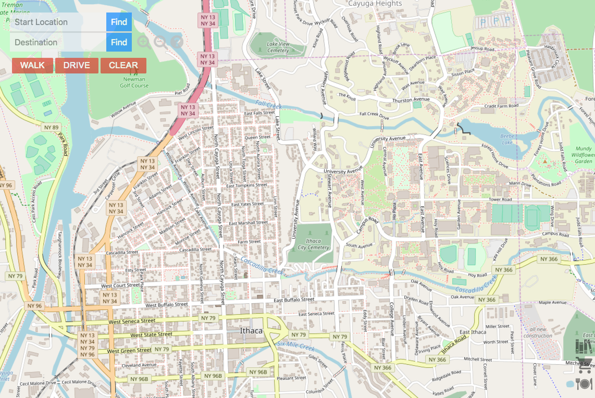
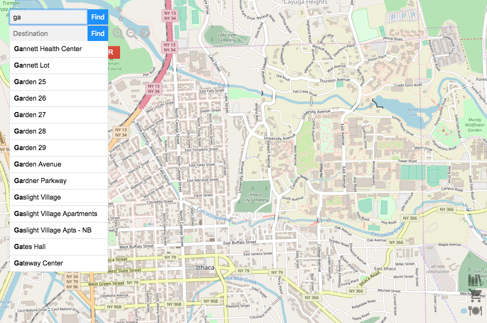
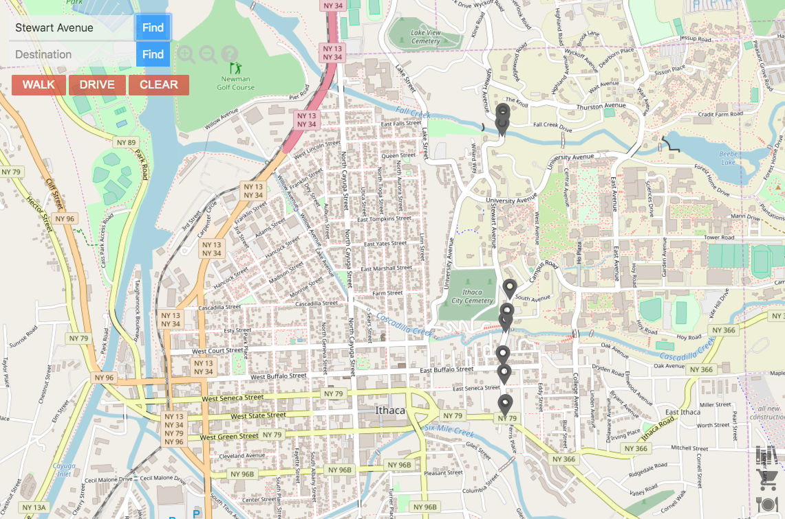
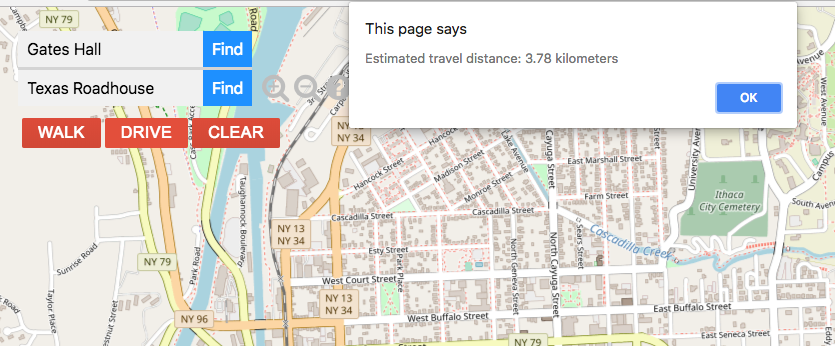
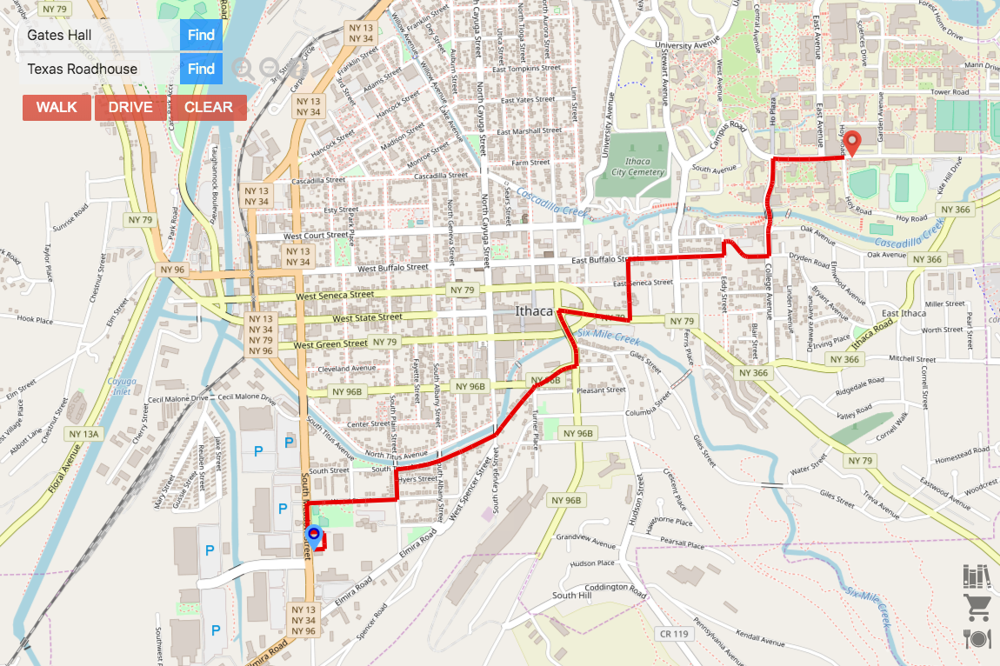
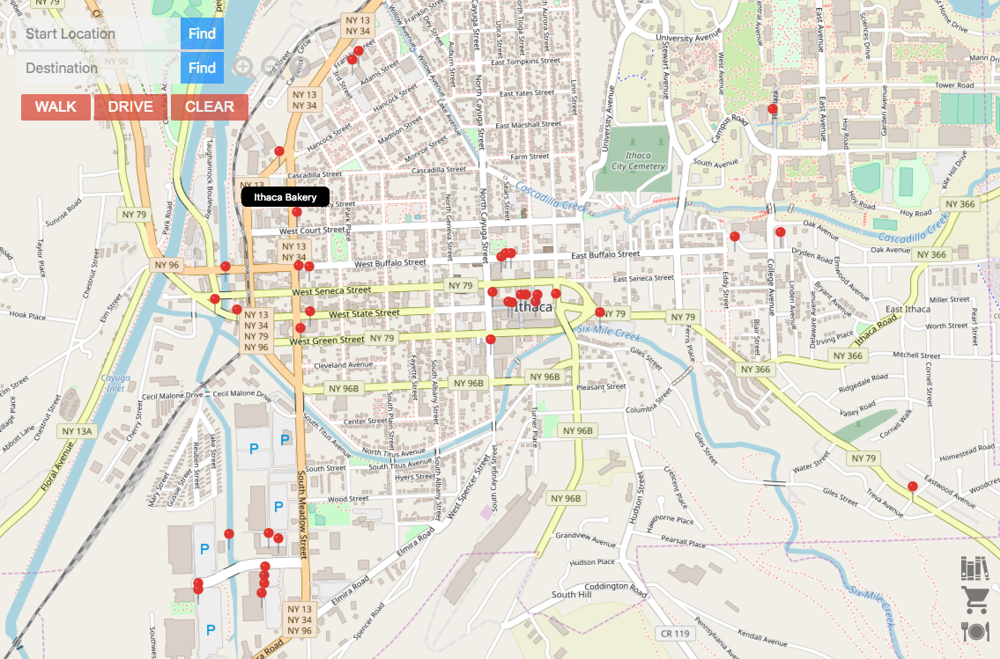

# Ithaca Map

## Description
Ithaca Map is a location based map services that resembles Google Map, including zooming in and out the map, moving the map, auto-completion enabled search, finding shortest path, and category search.

## How to Run
OCaml 4.06 and Opam must be installed. 

1. Install dependencies, run: 
`make install-dep`

2. Build the modules required by server and start server, run: 
`make server`

3. Build gui, open another terminal window, run: 
`cd gui` 
`make`

4. Open `index.html` from gui/ in your web browser.

## Key Features
#### 1. Draggable / Zoomable interactive map for Ithaca

#### 2. Location search with autocompletion

#### 3. Location search result pinpointing

#### 4. Graphical navigation

#### 5. Attractions recommendation by category

## Data
All data is downloaded from OpenStreetMap.org

## Acknowledgements
The CSS styles for GUI are borrowed from the skeleton code of a class project but our GUI is entirely coded in OCaml. The tile images are made possible by OpenStreetMap under Creative Commons Attribution-ShareAlike 2.0 licence.

